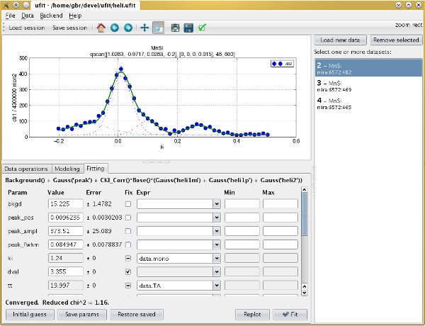

ufit overview
=============

ufit is a universal neutron scattering data fitting package for use both in
noninteractive scripts, and with a graphical user interface.

It handles complex fitting functions by combining them from pre-defined Pythonic
"model" objects and handling parameter constraints and interdependencies well.

Fitting is done by one of several backends:

* `lmfit`_\'s Levenberg-Marquardt least-squares that allows parameter
  constraints
* Minuit's "migrad" algorithm (via `iminuit`_)
* Basic Levenberg-Marquardt least-squares from `scipy.optimize`_

Results can be easily plotted and further processed.  Plotting is handled by
`matplotlib <http://matplotlib.org/>`_.

The GUI uses `PyQt 5
<http://www.riverbankcomputing.co.uk/software/pyqt/intro>`_.

.. _lmfit: http://cars9.uchicago.edu/software/python/lmfit/
.. _iminuit: https://github.com/iminuit/iminuit/
.. _scipy.optimize: http://docs.scipy.org/doc/scipy/reference/generated/scipy.optimize.leastsq.html

Contents:

.. toctree::
   :maxdepth: 2

   intro
   script
   gui
   models

Sample script usage::

   # import all ufit API plus pylab
   from ufit.lab import *

   # set a template, so that data can be referenced by number only
   set_datatemplate('path/to/data%04d.dat')
   # read one dataset from a file, with given X and Y columns
   data = read_data(104, 'A3', 'CNTS')

   # create a model of a simple Gaussian peak with given initial guess
   model = Background() + Gauss('peak', pos=97.5, ampl=100, fwhm=0.5)

   # fit the model, then print and plot the result
   result = model.fit(data)
   result.printout()
   result.plot()
   show()

GUI screenshot:

Indices and tables
==================

* :ref:`genindex`
* :ref:`modindex`
* :ref:`search`

